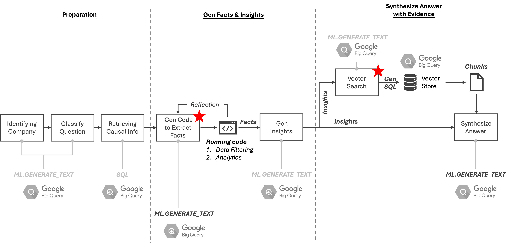
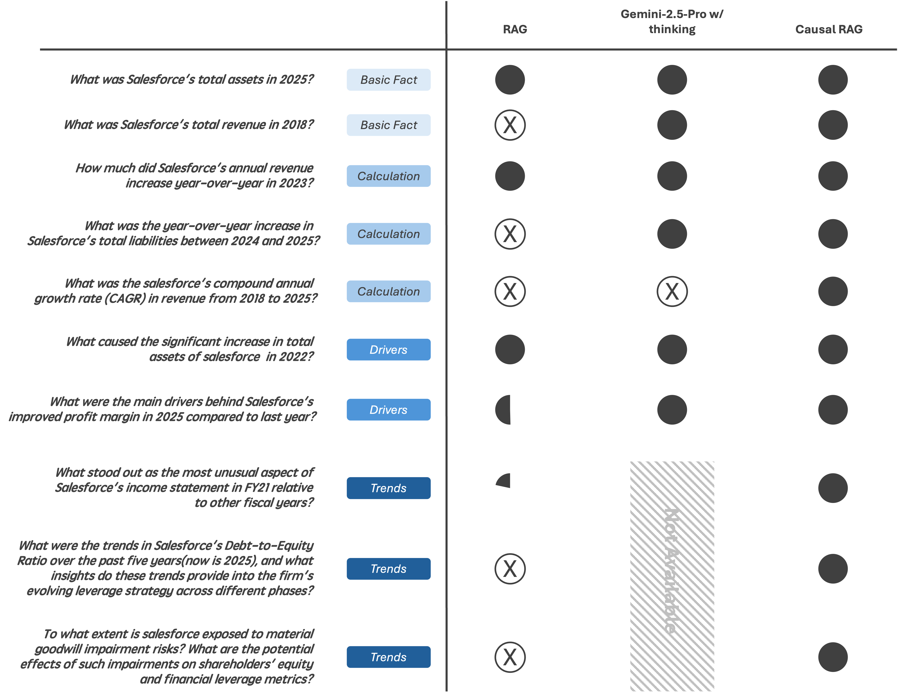

# CAUSAL RAG

**Integrating Causal Graphs and Generative AI for Reliable Fact Extraction and Deep Reasoning**

Causal RAG is an AI agent designed to answer complex financial questions by combining causal graphs, sentiment analysis, and structured data with BigQuery’s native generative AI and vector search. It extends traditional Retrieval-Augmented Generation (RAG) to provide accurate, interpretable insights for both straightforward and non-obvious “what” and “why” questions.

## Features

- **Causal Graph-Based Reasoning:** Models qualitative and quantitative relationships among financial variables to uncover root causes.
- **Fact Extraction via Code Generation:** Generates Python code to extract accurate facts from pre-built approximations of 10-K reports.
- **Insight Generation:** Distilled facts are analyzed by a foundation model to produce actionable insights.
- **Evidence Retrieval:** Retrieves supporting content from chunked 10-K reports in BigQuery using vector search.
- **Scalable and Cost-Efficient:** Avoids loading entire datasets into foundation models, reducing cost and improving stability.

## Architecture


1. **Preparation:** Parse queries and classify user intentions.
2. **Facts & Insights Generation:** Generate executable code to extract facts; insights are produced using a foundation model.
3. **Answer Synthesis with Evidence:** Perform vector search for relevant content to support insights and produce final answers.


## Evaluation



- Outperforms baseline RAG in both basic calculations and complex causal questions.
- More stable and scalable than using foundation models like Gemini 2.5 Pro alone.
- Excels in trend analysis and multi-document reasoning.


## Getting Started

Clone the repository and follow instructions to set up your BigQuery environment:

```bash
git clone https://github.com/Laoyu84/bq_causal_rag
cd bq_causal_rag
pip install -r requirements.txt
python causal_rag.py
# if root permission is required for Google Cloud auth, run following command instead:
sudo python causal_rag.py

```
Public dataset: `bigquery-hackathon-470303.hackathon_bigquery`
